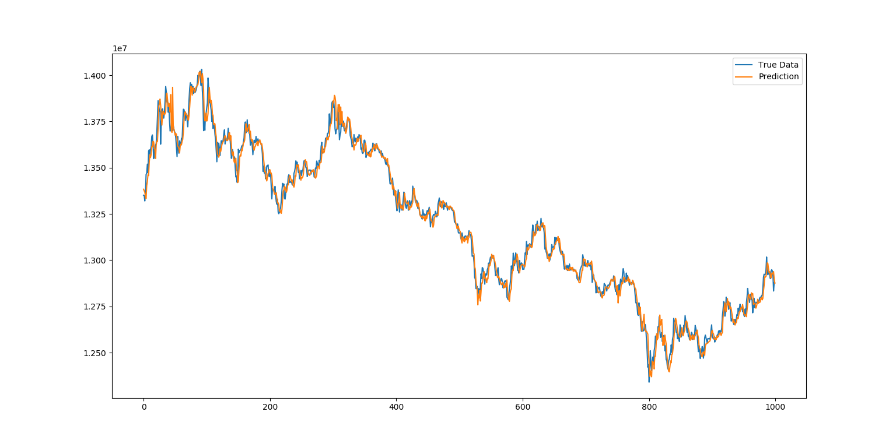
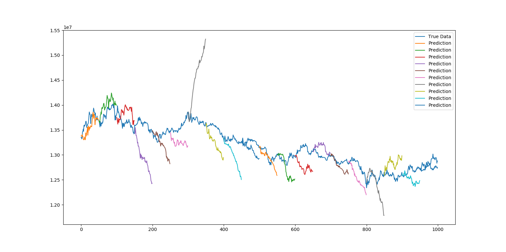

# LSTM-Neural-Network-for-Bitcoin-Price-Prediction
started from [jaungiers/Multidimensional-LSTM-BitCoin-Time-Series] 
which also has awesome [article] 

It was first implemented using **Keras** as article, and now only uses **Tensorflow**

[jaungiers/Multidimensional-LSTM-BitCoin-Time-Series]: https://github.com/jaungiers/Multidimensional-LSTM-BitCoin-Time-Series
[article]: http://www.jakob-aungiers.com/articles/a/Multidimensional-LSTM-Networks-to-Predict-Bitcoin-Price

## Current Result

***This repository is(and will be) updated very frequently for improving the prediction. Thus, below results could be far differ from result in actual run.*** 

Input Data : time, open, high, low, close, accprice(volume in korean won), volume

Period : 2017-11-15 13:27:00 ~ 2018-01-24 00:07:00 ***--> total (100000, 6) data by 1 minute***

x_window_size = 50, y_window_size = 1, batch_size = 1000
, standardize input per every window(sequence)

* **predict every t+1 based on x_window data(t-49, t-48, ... ,t-1, t)**

* **predict (t+1, t+2, ... t+50) based on x_window data(t-49, t-48, ... ,t-1, t)**

## Work in Progress and Future Plan
1. Real-time prediction and plotting the result interactively
2. Input other coin data for training
3. Batch Normalization
4. Ensemble the model with a new model which takes input of all the data before t+1 (t, t-1, t-2 ...)
